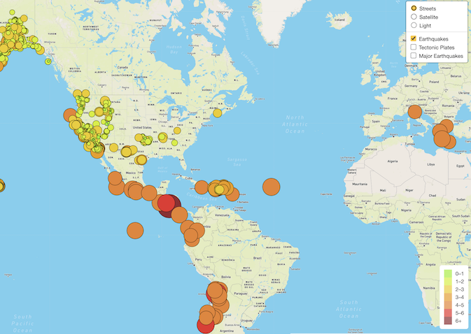
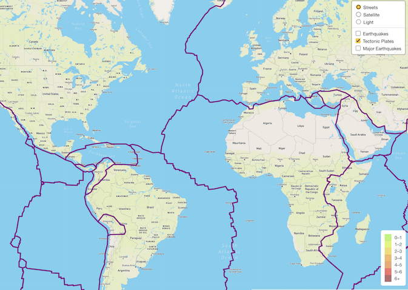
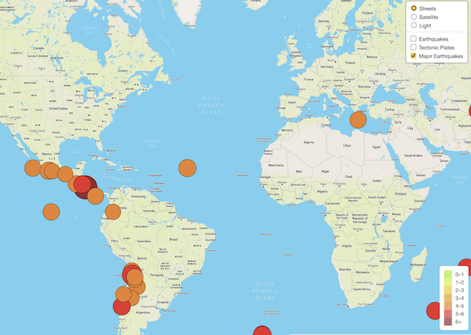
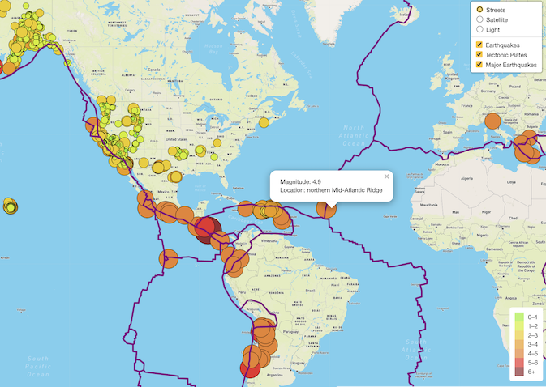
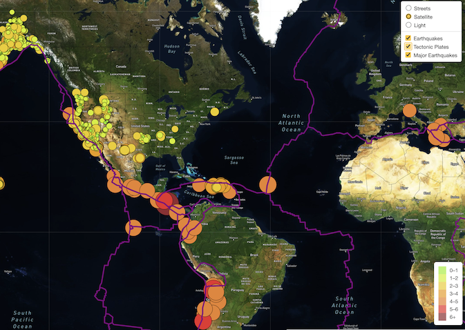
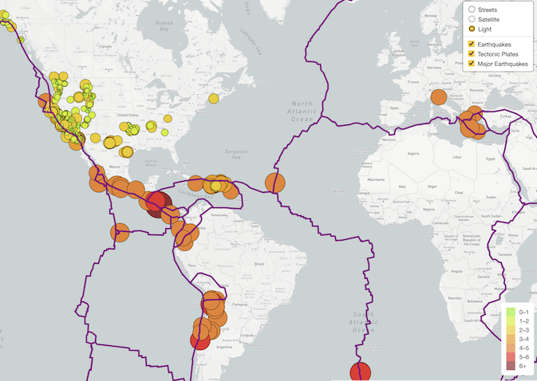

# Mapping_Earthquakes
Mapping Earthquakes with JavaScript &amp; APIs

## Project Overview

Create interactive maps using JavaScript and the D3 library to traverse and retrieve GeoJSON earthquake and tectonic plate data from the past 7 days, where the the magnitude of the earthquake is displayed on circles that varies in size and color according to its strenght, which details can be seen on apopup box upon clicked. As well, as the Leaflet library to plot the data on a Mapbox map through an API request.

## Design Solution

- Use GitHub to:
    - Create branches from the mainn branch
    - Add, commit, and push data to gitHub branches.
    - Merge branches with the main branch.
- Retrieve data from a GeoJSON file.
- Make API requests to a server to host geographical maps with 
- Populate geographical maps with GeoJSON data using JavaScript and the Data-Driven Documents (D3) library.
- Add multiple map layers to geographical maps using Leaflet control plugins to add user interface controls.
- Use JavaScript ES6 functions to add GeoJSON data, features, and interactivity to maps.
- Render maps on a local server.

### All Earthquakes

- All Earthquakes from the past 7 days on the Streets map style.

### Tectonic Plates

- Tettonic plates on the Streets map style.

### Major Earthquakes

- Only Earthquakes with magnitude 4.5 and above from the past 7 days, on the Streets map style.

### Streets Map Style with a Popup Box

-  All the datasets selected and displayed on the Street map style, with the popup box of the circle containing the details of that earthquake.

### Satellite Map Style

-  All the datasets selected and displayed on the Satellite map style.

### Light Map Style

- All the datasets selected and displayed on the Light map style.

